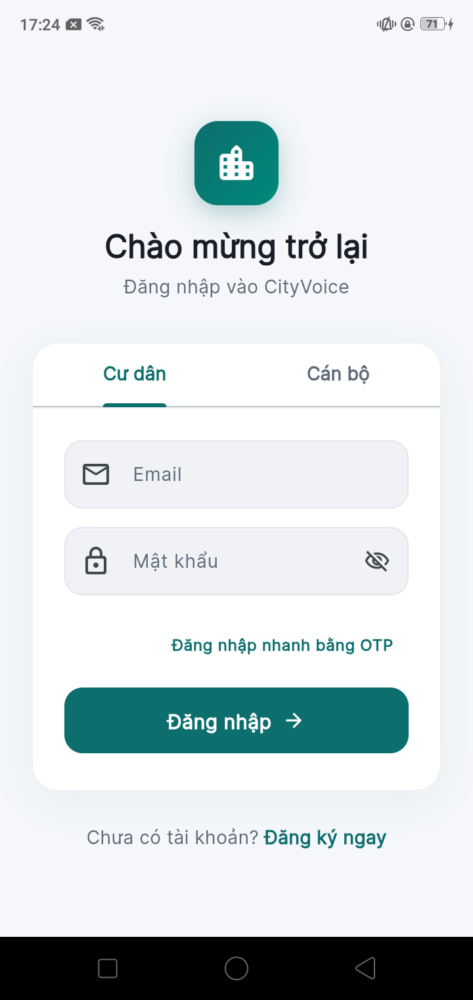
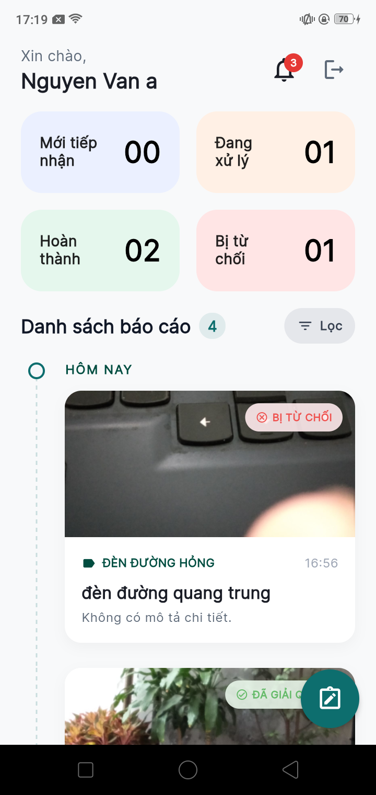
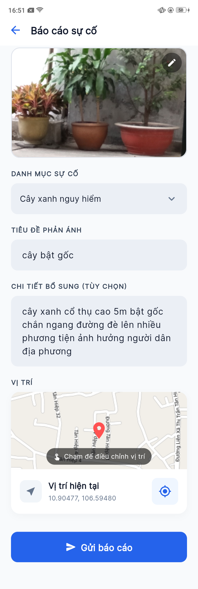
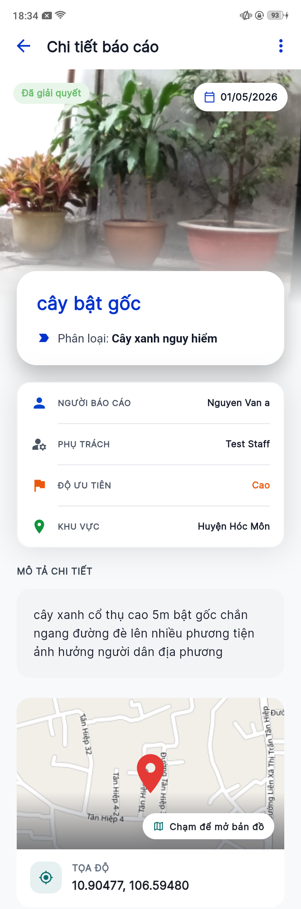
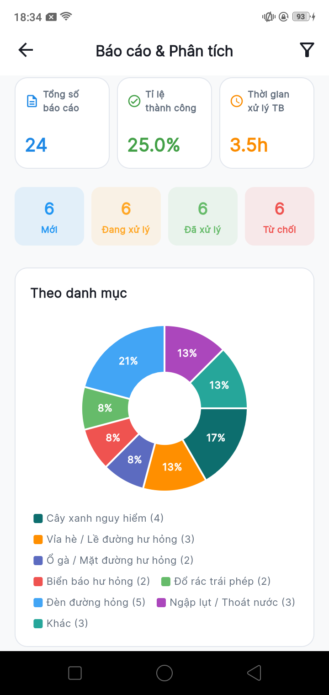
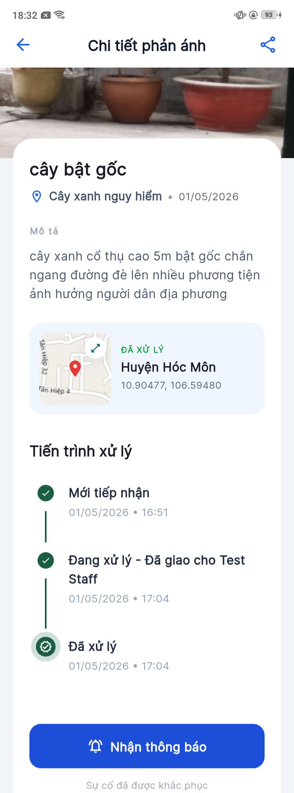
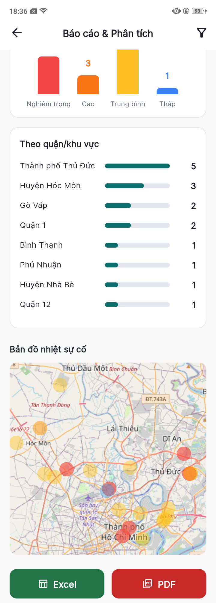
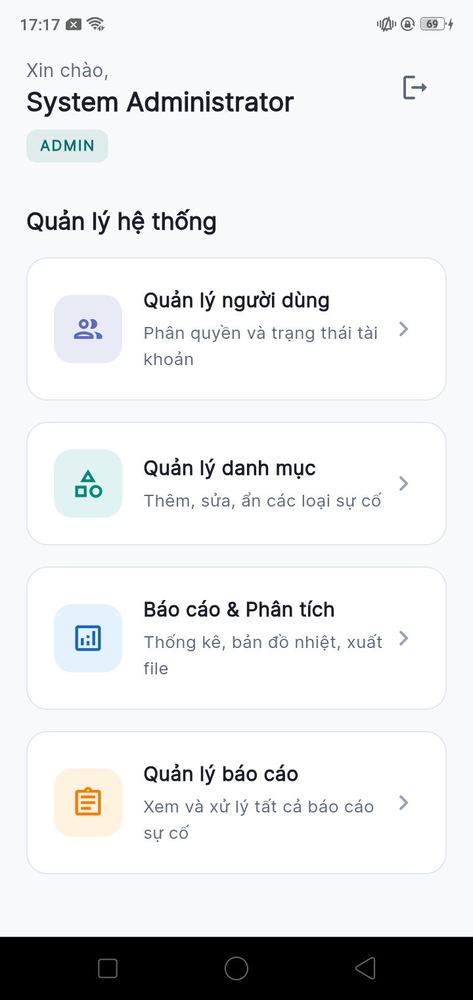
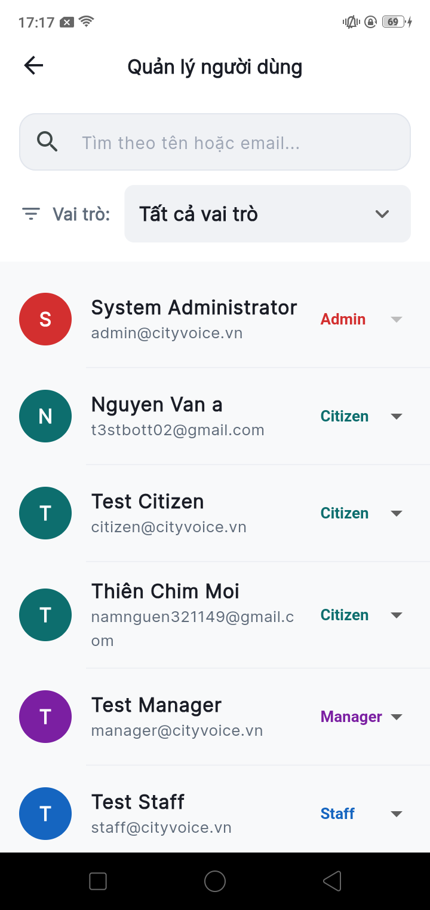

# 🏙️ CityVoice — Civic Issue Reporting Platform

> A mobile application empowering citizens of Ho Chi Minh City to report infrastructure issues, enabling government staff to manage and resolve them efficiently.

**CityVoice** is a full-stack civic engagement platform where citizens submit geo-tagged incident reports (potholes, broken streetlights, flooding, etc.), staff triage and resolve them through a structured workflow, and managers access real-time analytics with interactive heatmaps. This repository contains the **Flutter mobile client**.

---

## 📱 Screenshots

<p align="center">
  
  &nbsp;
  
  &nbsp;
  
  &nbsp;
  
  &nbsp;
  
</p>

<details>
<summary>🖼️ View more screenshots</summary>
<br>
<p align="center">
  
  &nbsp;&nbsp;
  
  &nbsp;&nbsp;
  
  &nbsp;&nbsp;
  
</p>
</details>

---

## ✨ Key Features

### 🧑‍💼 Citizen Portal
- **Incident Reporting** — Submit reports with photo upload, dynamic category selection, and automatic GPS tagging
- **Geospatial Validation** — GPS coordinates validated against the official HCMC administrative boundary via PostGIS `ST_Contains()`
- **Report Tracking** — View personal report history with status updates
- **OTP Authentication** — Passwordless login via Email + OTP for a frictionless experience

### 👷 Staff Dashboard
- **Report Triage** — Review incoming reports for authenticity, set priority levels, and assign to personnel
- **Workflow State Machine** — Strictly enforced status transitions: `newly_received → in_progress → resolved` (or `→ rejected`)
- **Proof of Resolution** — Upload completion photos before marking reports as resolved
- **Audit Trail** — Every status change is logged with timestamp, acting user, and optional notes

### 📊 Manager Analytics
- **Interactive Heatmap** — Geo-tagged reports overlaid on a map of HCMC, color-coded by priority
- **Statistical Charts** — Category breakdowns, status distributions, and trend analysis via `fl_chart`
- **Multi-Criteria Filtering** — Filter by timeframe, category, district (22 HCMC zones), and priority
- **Data Export** — Generate PDF and Excel reports for completion rates and resolution time metrics

### 🔐 Admin Panel
- **User Management** — Search, filter, and assign roles (`citizen`, `staff`, `manager`, `admin`)
- **Category Management** — CRUD operations on dynamic incident categories
- **System Configuration** — Full administrative control over platform settings

---

## 🏗️ Architecture

The app follows a **feature-based MVVM (Model-View-ViewModel)** pattern with clear separation of concerns:

```
lib/
├── main.dart                     # Entry point & dependency injection
├── app.dart                      # Root MaterialApp with GoRouter
├── core/                         # Shared infrastructure
│   ├── auth/                     # RBAC role definitions & extensions
│   ├── constants/                # API endpoints & app constants
│   ├── network/                  # Dio client, interceptors, API response handling
│   ├── routes/                   # GoRouter configuration & route guards
│   ├── storage/                  # Secure storage for JWT tokens
│   ├── theme/                    # Design system (colors, typography, themes)
│   ├── utils/                    # Shared utilities
│   └── widgets/                  # Reusable UI components
└── features/                     # Feature modules
    ├── auth/                     # Authentication (login, register, OTP)
    ├── reports/                  # Citizen report submission & tracking
    ├── review/                   # Staff workflow & report management
    ├── analytics/                # Manager dashboard & heatmaps
    └── admin/                    # Admin user & category management
```

Each feature module is self-contained with:
```
feature/
├── models/        # Data models with JSON serialization
├── services/      # API communication layer
├── viewmodels/    # Business logic & state management
└── views/         # UI screens & widgets
```

### Architecture Highlights

| Concern | Implementation |
|---|---|
| **State Management** | Provider + ChangeNotifier with granular `context.select()` rebuilds |
| **Networking** | Dio with custom interceptors for auth, error handling, and response parsing |
| **Token Management** | JWT access/refresh tokens with automatic silent refresh and concurrency-safe locking |
| **Routing** | GoRouter with role-based redirect guards and auth-aware navigation |
| **Data Models** | Hand-crafted immutable models with `fromJson` factory constructors |
| **Secure Storage** | Flutter Secure Storage for persisting sensitive tokens |
| **Maps** | Flutter Map (Leaflet-based) with OpenStreetMap tiles |

---

## 🛠️ Tech Stack

| Layer | Technology |
|---|---|
| Framework | Flutter 3.x / Dart 3.5+ |
| State Management | Provider 6.x |
| Navigation | GoRouter 14.x |
| Networking | Dio 5.x |
| Maps & Geo | Flutter Map + Geolocator + LatLong2 |
| Charts | FL Chart |
| Secure Storage | Flutter Secure Storage |
| Image Handling | Image Picker + Cached Network Image |
| UI Enhancements | Google Fonts, Flutter SVG, Shimmer loading |

### Backend (separate repository)

| Layer | Technology |
|---|---|
| API Server | Java 21 + Spring Boot 3.4.3 |
| Database | PostgreSQL 17 + PostGIS 3.5 |
| Migrations | Flyway |
| Containerization | Docker Compose |

---

## 🔐 Role-Based Access Control

The app implements four distinct user roles, each with tailored dashboards and permissions:

| Role | Capabilities |
|---|---|
| `citizen` | Submit reports, view own reports, track report status |
| `staff` | Triage, assign, update report status, upload resolution proof |
| `manager` | Access analytics, heatmaps, generate PDF/Excel exports |
| `admin` | All manager permissions + user role management + category CRUD |

Role-based routing ensures users are redirected to the appropriate dashboard on login and cannot access unauthorized routes.

---

## 🚀 Getting Started

### Prerequisites

- [Flutter SDK](https://docs.flutter.dev/get-started/install) (3.x or later)
- Dart SDK 3.5+
- Android Studio / Xcode (for emulators)
- Running backend instance (see backend repo for setup)

### Installation

```bash
# 1. Clone the repository
git clone https://github.com/finnzxje/city-voice.git
cd city-voice/mobile

# 2. Install dependencies
flutter pub get

# 3. Run the app
flutter run
```

### Environment Configuration

The app connects to the backend API. Update the base URL in `lib/core/constants/api_constants.dart` to point to your backend instance.

---

## 🧪 Report Workflow State Machine

```
┌────────────────┐     staff accepts      ┌────────────────┐     staff resolves     ┌──────────────┐
│                │ ──────────────────────►│                │ ──────────────────────►│              │
│ newly_received │                        │  in_progress   │   (+ proof image)      │   resolved   │
│                │                        │                │                        │              │
└────────┬───────┘                        └────────────────┘                        └──────────────┘
         │
         │ staff rejects
         ▼
┌────────────────┐
│   rejected     │
└────────────────┘
```

- Transitions are **strictly enforced** — no status skipping is allowed
- Each transition records: timestamp, acting user, `from_status`, `to_status`, and optional notes
- Resolution requires a **proof-of-completion photo**

---

## 📄 License

This project was developed as part of a portfolio project demonstrating full-stack mobile development capabilities.

---

<div style="text-align: center;">
  Built with ❤️ using Flutter
</div>
